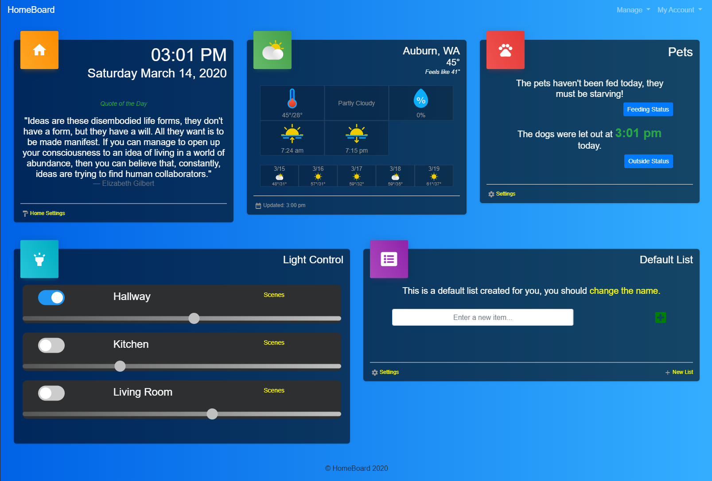

# HomeBoard

HomeBoard is a CMS designed for your home. Created for busy families who need quick access to shared information within the house. An ideal usage for HomeBoard is to display it on a touchscreen monitor within the most active area of your home.

HomeBoard currently includes 6 different widgets to display on the dashboard. Choose 1, or all 6, and customize the look to meet your needs!

* Track and log important daily tasks such as feeding the pets or taking the dog for a walk.
* Add items to a Grocery or To-Do list where everyone can see it.
* Control your Philips Hue light system
* View a shared calendar and add events as needed.
* View up-to-date local weather information
* Display the time, date, and a quote of the day
 
## Usage

* After cloning this repo, run 'bundle install' to install dependencies.

* To create your local database, run 'rake db:create' and 'rake db:migrate'.

* You can start the application (without secure connection) by running rails s from the application root folder. Then in a browser, go to http://localhost:3000/ to begin.

## Screenshots

## Contributing

Bug reports and pull requests are welcome on GitHub at https://github.com/cskerbo/HomeBoard. This project is intended to be a safe, welcoming space for collaboration, and contributors are expected to adhere to the [Contributor Covenant](http://contributor-covenant.org) code of conduct.